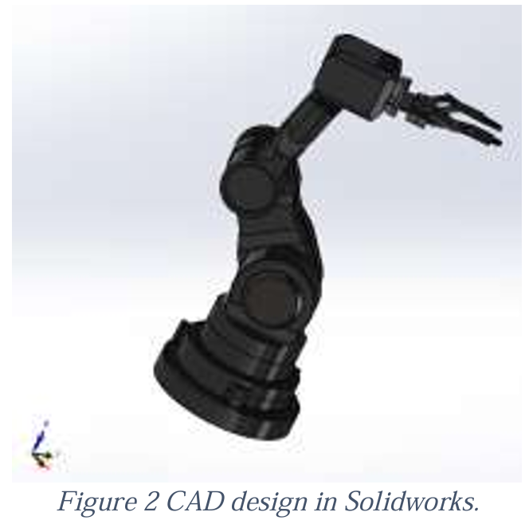
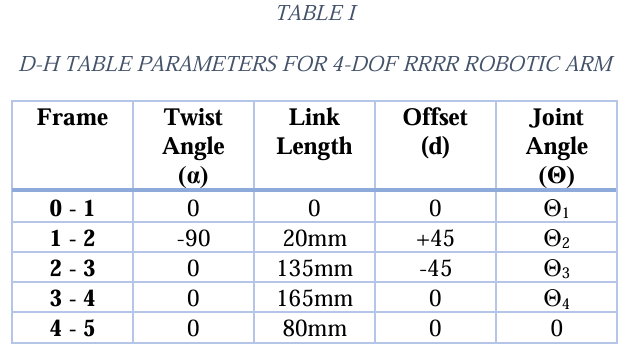
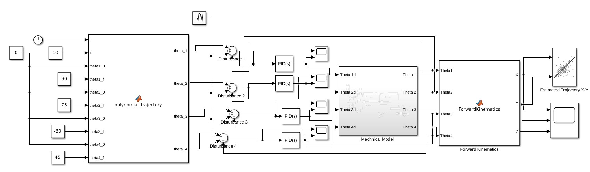
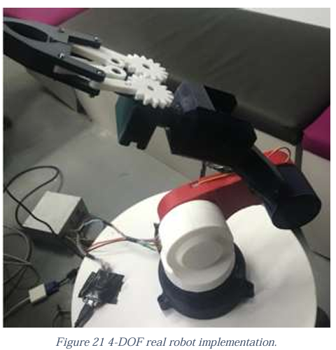

# 4-DOF RRRR Robotic Arm Design, Simulation, and Implementation

## Project Overview
This repository contains the complete design, mathematical modeling, control simulation, and physical implementation of a custom 4-Degree-of-Freedom (DOF) robotic arm. I designed this manipulator specifically with an RRRR configuration to execute industrial pick-and-place tasks. This project is my theoretical and practical experience, starting with the derivation of kinematic and dynamic equations, progressing to MATLAB/Simulink simulations, and culminating in the construction of a physical prototype using 3D-printed PLA parts and an ESP32 microcontroller.

## Mathematical Modeling & Kinematics
A significant portion of this project was dedicated to establishing a rigorous theoretical foundation for the manipulator's movements.

*   **Forward Kinematics:** I utilized the Denavit-Hartenberg (D-H) convention to systematically assign coordinate frames to each joint. By defining the twist angles, link lengths, offsets, and joint angles, I generated the D-H table and computed the homogeneous transformation matrices. This allowed me to accurately map the end-effector's position and orientation relative to the base frame.

*   **Inverse Kinematics:** To determine the necessary joint angles for a desired end-effector position, I implemented a geometric approach. To simplify the complexity of the 3D space, I decoupled the analysis: I calculated the first joint's angle based on the horizontal (X-Y) plane and analyzed the remaining three joints on a 2D planar projection (Z-X plane).
*   **Dynamics:** I derived the complete dynamic model, calculating the Inertia Matrix, Coriolis and Centrifugal forces, and Gravity terms. *Note: To keep the theoretical model within a manageable scope for the initial simulation, motor friction coefficients (Coulomb and viscous) were assumed to be zero.*

## Control and Simulation (MATLAB/Simulink)
To validate the mathematical models and test control strategies before hardware implementation, I built a comprehensive simulation environment in MATLAB and Simulink.

*   **Physical Modeling:** Instead of directly importing the CAD files, I constructed the mechanical properties of the robot (representing links and revolute joints) utilizing Simscape Multibody blocks.
*   **PID Control:** I designed and tuned independent PID controllers for each joint. These controllers calculate the necessary torques to minimize angular positioning errors and ensure stable motion.
*   **Robustness Testing:** To evaluate the system's stability, I injected random external disturbance signals into the simulation and verified the PID controllers' ability to compensate for these unexpected forces.

## Hardware & Prototyping
To bring the theoretical models to life, I constructed a functional physical prototype.

*   **Manufacturing:** I 3D-printed the structural links using PLA filament, providing a lightweight yet rigid frame suitable for rapid prototyping.
*   **Electronics:** The arm is actuated by four DS3225 (270-degree) servo motors. I programmed an ESP32 microcontroller to generate the precise PWM signals required to drive these motors. A dedicated 5V external power supply with a common ground was integrated via a breadboard to ensure stable current delivery to the actuators.

## Limitations & Simplifications
While the project successfully demonstrates core robotics principles, I acknowledge a few approximations and limitations in the current build:
1.  **Friction Assumptions:** The theoretical dynamic equations were simplified by ignoring joint friction.
2.  **End-Effector Integration:** Although I designed and mounted a mechanical gripper, it has not yet been fully integrated into the electronic control loop or the kinematic code for automated operation.
3.  **Real-Time Trajectory Execution:** Currently, the smooth 5th-order polynomial trajectories are calculated perfectly in MATLAB simulations. However, seamlessly streaming these high-resolution, time-dependent angular targets to the ESP32 for real-time hardware execution remains an area for future optimization.
